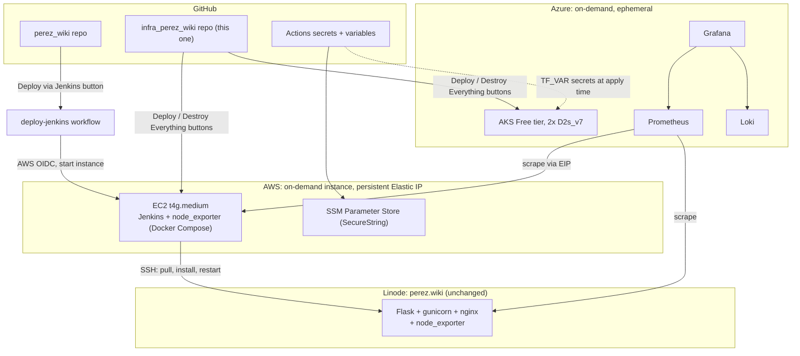

# infra_perez_wiki

Infrastructure for a Jenkins CI cluster (AWS) and a Grafana/Prometheus/Loki monitoring
stack (Azure), built around my [perez_wiki](https://www.perez.wiki) website. A 
demo of some basic terraform and cloud concepts.

## Architecture
*Chart produced by Anthropic's Claude*


## Setup

1. Apply the persistent configs by hand: `bootstrap/aws`, `bootstrap/azure`,
   `aws/jenkins/iam`, `azure/monitoring/iam`. They hold the state backends, OIDC
   trust, and the Jenkins Elastic IP, all of which must outlive the ephemeral
   stacks. Each has its own README.
2. Set the repo secrets and variables (see [Secrets](#secrets)).

## Usage

Everything runs from this repo's **Actions** tab. 

- **Deploy Everything** / **Destroy Everything** - both stacks at once, in parallel.
- **Deploy Jenkins** / **Destroy Jenkins** - AWS
- **Deploy Monitoring** / **Destroy Monitoring** - Azure

A successful deploy writes the access commands into the summary panel.

The stacks bill by the hour, so please hit the destroy button when you're done. 

## Repo layout

```
bootstrap/
  aws/      TF that creates the S3 bucket used as the remote state
            backend for aws/jenkins (SSE-S3, no customer-managed KMS key
            needed). Uses a deterministic account-ID-based bucket name and
            a guarded `import` block designed for belt-and-suspenders
            idempotent re-runs. That automatic create/import dance
            was never actually wired into `deploy-jenkins.yml`, which
            just assumes the bucket already exists (it does, applied
            manually once). See bootstrap/aws/README.md.
  azure/    Same idea, creates the Azure Storage Account and
            container used as the remote state backend for azure/monitoring.
aws/
  jenkins/
    iam/      OIDC provider + IAM roles, plus a persistent Elastic
              IP for the Jenkins box (a stable scrape target for Prometheus,
              kept here so the address survives teardown). Applied once,
              manually, never destroyed by the on-demand lifecycle.
              Permission set grew from CI errors (see project
              memory/history). Expect to revisit if new AWS actions get
              exercised later.
    compute/  EC2 instance, security group, SSM parameters, Docker
              Compose (Jenkins + node_exporter), and the EIP association
              (attaches iam's Elastic IP to the instance). Created every
              session via `terraform apply -replace="aws_instance.jenkins"`
              (needed because plain `apply` hasn't reliably detected
              user_data changes on this resource).
azure/
  monitoring/
    iam/    Azure AD app registration and federated credentials.
            Two credentials, since Azure requires an exact subject match
            per credential and can't use a wildcard like AWS's trust
            policy. Also sets up the RBAC role assignments. Applied once,
            manually, never destroyed.
    aks/    AKS cluster (Free tier), node pool (2x
            `Standard_D2s_v7`; B-series burstable VMs aren't in this
            subscription's allowed SKU list at all, a Free Trial
            restriction, and the vCPU quota only allows 4 total, hence 2
            nodes instead of 3), and Helm releases for
            Grafana/Prometheus/Loki. ServiceAccount
            tokens and unused RBAC objects stripped where the workload
            doesn't need Kubernetes API access. Secrets come from
            Terraform variables. Deployed and destroyed via GitHub Actions
            buttons (deploy-monitoring.yml / destroy-monitoring.yml). See
            azure/monitoring/aks/README.md.
.github/workflows/
  deploy-jenkins.yml       Both workflow_call (reusable,
                           called by perez_wiki's "Deploy via Jenkins") and
                           workflow_dispatch (its own button in this repo's
                           Actions tab, for redeploying without going through
                           perez_wiki). Applies aws/jenkins/compute (with
                           -replace to force a fresh instance every run),
                           waits for Jenkins via SSM Run Command (not a
                           direct public curl, since port 8080 is only open
                           to admin_cidr and the runner isn't in it), then
                           triggers the deploy-perez-wiki job the same way
                           (crumb fetch + POST, both over SSM). The trigger
                           step reads the Jenkins password from SSM Parameter
                           Store on the instance, so it never rides in the
                           Run Command payload. The perez_wiki caller stays
                           workflow_dispatch-only by design; flip it to
                           `push: branches: [main]` once confident.
  destroy-jenkins.yml      workflow_call + workflow_dispatch
                           (its own button, and callable from
                           destroy-everything). Needs the same 4 secrets
                           (LINODE_SSH_PRIVATE_KEY, JENKINS_ADMIN_PASSWORD,
                           EXPORTER_BASIC_AUTH_HASH, ADMIN_CIDR) in this repo,
                           since it isn't called from perez_wiki.
  deploy-monitoring.yml    Azure equivalent of
                           deploy-jenkins. workflow_call + workflow_dispatch.
                           Azure OIDC login, applies azure/monitoring/aks
                           (tf-init + apply), then lists the monitoring pods.
                           Reads GRAFANA_ADMIN_PASSWORD, LINODE_EXPORTER_PASSWORD,
                           JENKINS_EXPORTER_PASSWORD (secrets) and the
                           JENKINS_EXPORTER_TARGET repo variable.
  destroy-monitoring.yml   workflow_call + workflow_dispatch, same
                           concurrency group as deploy-monitoring. Needs
                           GRAFANA_ADMIN_PASSWORD + LINODE_EXPORTER_PASSWORD.
  deploy-everything.yml    THE ONE BUTTON. workflow_dispatch that calls
                           deploy-jenkins and deploy-monitoring in
                           parallel (independent stacks), forwarding secrets.
  destroy-everything.yml   Calls destroy-jenkins and destroy-monitoring
                           in parallel. Leaves the persistent pieces
                           (bootstrap, iam, the EIP) alone.
```

## Secrets

- **GitHub Secrets** :
  - `LINODE_SSH_PRIVATE_KEY` - SSH key Jenkins uses to deploy to the Linode box
  - `JENKINS_ADMIN_PASSWORD` - the Jenkins `admin` user password
  - `EXPORTER_BASIC_AUTH_HASH` - bcrypt hash for the Jenkins node_exporter's basic auth
  - `ADMIN_CIDR` - the IP allowed to reach the Jenkins UI (port 8080)
  - `GRAFANA_ADMIN_PASSWORD` - the Grafana `admin` password
  - `LINODE_EXPORTER_PASSWORD` - password Prometheus sends to scrape the Linode box
  - `JENKINS_EXPORTER_PASSWORD` - password Prometheus sends to scrape the Jenkins box

- **GitHub Variables** :
  - `JENKINS_EXPORTER_TARGET` - the Jenkins Elastic IP as `host:port`

- **External Secrets**
- *AWS side:* SSM Parameter Store, Standard tier, `SecureString` type, encrypted
  with the AWS-managed KMS key (`aws/ssm`) to stay completely free.
- *Azure side:*  values come from Terraform variables
  (`grafana_admin_password`, `linode_exporter_password`), set as `TF_VAR_*`
  environment variables and injected into the Helm releases at apply time.
  See azure/monitoring/aks/README.md

## Cost (on-demand, fully ephemeral)

You might be saying - that seems backwards. Why is your monitoring ephemeral and
your app persistent? Well, I don't have 230 bucks a month to burn on a small app
that is mainly evidence of my being able to do some basic stuff in the cloud.

| Piece | Compute | Per demo-hour | Always-on equivalent (for context) |
|---|---|---|---|
| AWS: EC2 t4g.medium, Jenkins | ~$0.034/hr | ~$0.034/hr | ~$24.82/mo |
| Azure: AKS Free tier, 2x D2s_v7 | ~$0.264/hr | ~$0.264/hr | ~$193/mo |

Everything but the bootstraps are destroyed between sessions. 
See each module's README for the exact `terraform destroy` scope.
