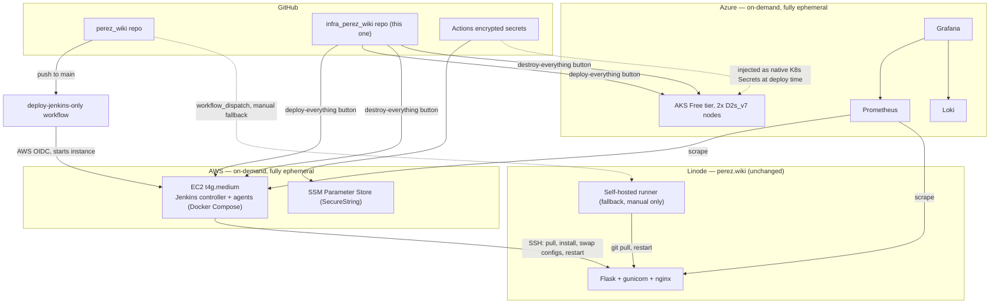

# infra_perez_wiki

Infrastructure for a Jenkins CI cluster (AWS) and a Grafana/Prometheus/Loki monitoring
stack (Azure), built around my [perez_wiki](https://www.perez.wiki) website.

**Status:** both sides work now. `bootstrap/aws`, `aws/jenkins/iam`, `bootstrap/azure`,
and `azure/monitoring/iam` are all applied. `aws/jenkins/compute` deploys automatically
through GitHub Actions: `perez_wiki`'s "Deploy via Jenkins" button triggers this repo's
`deploy-jenkins-only.yml`, which spins up a fresh Jenkins instance and deploys to the
Linode box. `azure/monitoring/aks` has been built, tested locally with `kind`, and
confirmed working against a real AKS cluster: Grafana, Prometheus, and Loki all running,
scraping the Linode box's metrics. It doesn't have a GitHub Actions button yet, so it's
applied and destroyed by hand. See [Build order](#build-order) for what's left.

## Architecture
*Chart produced by Anthropic's Claude*


## Two independent lifecycle paths for Jenkins

1. **Built and working**: `perez_wiki`'s "Deploy via Jenkins" workflow calls
   `deploy-jenkins-only.yml` here. That caller is currently `workflow_dispatch`-only,
   not yet wired to real pushes. It starts a fresh EC2 instance via AWS OIDC, waits for
   Jenkins via SSM Run Command, and triggers the `deploy-perez-wiki` job, which SSHes
   into the Linode box and runs the same steps the old self-hosted-runner workflow
   did: `git pull`, reinstall deps, swap the nginx/systemd config files, restart the
   service.

   `deploy-jenkins-only.yml` also has its own `workflow_dispatch` trigger, so it
   shows up as a **"Deploy Jenkins Only"** button in this repo's Actions tab too,
   for redeploying Jenkins without going through `perez_wiki`. That path reads this
   repo's own 4 secrets (the same ones `destroy-jenkins.yml` needs); the `perez_wiki`
   caller passes them in instead.

   This does not self-terminate the instance afterward. It keeps running, and
   costing money, until torn down with the **"Destroy Jenkins"** workflow
   (`workflow_dispatch`, in this repo's Actions tab). That's on purpose, a manual
   button instead of something automatic, so a deploy can be inspected in the
   Jenkins UI before the instance disappears.
2. **Not yet built**: manual "deploy everything" / "destroy everything" buttons that
   stand up or tear down the full Jenkins and monitoring environment together, for demos.

The old self-hosted-runner workflow in `perez_wiki` stays registered on the Linode
box as a **manual fallback** (`workflow_dispatch`, not auto-triggered), in case the
AWS/Jenkins path is ever broken.

## Repo layout

```
bootstrap/
  aws/      APPLIED. TF that creates the S3 bucket used as the remote state
            backend for aws/jenkins (SSE-S3, no customer-managed KMS key
            needed). Uses a deterministic account-ID-based bucket name and
            a guarded `import` block designed for belt-and-suspenders
            idempotent re-runs. That automatic create/import dance
            was never actually wired into `deploy-jenkins-only.yml`, which
            just assumes the bucket already exists (it does, applied
            manually once). See bootstrap/aws/README.md.
  azure/    APPLIED. Same idea, creates the Azure Storage Account and
            container used as the remote state backend for azure/monitoring.
aws/
  jenkins/
    iam/      APPLIED. OIDC provider + IAM roles. Applied once, manually,
              never destroyed by the on-demand lifecycle. Permission set
              grew from real CI errors (see project memory/history).
              Expect to revisit if new AWS actions get exercised later.
    compute/  WORKING. EC2 instance, security group, SSM parameters, Docker
              Compose (Jenkins + node_exporter). Created every session via
              `terraform apply -replace="aws_instance.jenkins"` (needed
              because plain `apply` hasn't reliably detected user_data
              changes on this resource). Confirmed deploying successfully
              to the real Linode box via full GitHub Actions automation.
azure/
  monitoring/
    iam/    APPLIED. Azure AD app registration and federated credentials.
            Two credentials, since Azure requires an exact subject match
            per credential and can't use a wildcard like AWS's trust
            policy. Also sets up the RBAC role assignments. Applied once,
            manually, never destroyed.
    aks/    WORKING. AKS cluster (Free tier), node pool (2x
            `Standard_D2s_v7`; B-series burstable VMs aren't in this
            subscription's allowed SKU list at all, a Free Trial
            restriction, and the vCPU quota only allows 4 total, hence 2
            nodes instead of 3), and Helm releases for
            Grafana/Prometheus/Loki. Confirmed working against a real
            cluster, then torn down to stop the cost. ServiceAccount
            tokens and unused RBAC objects stripped where the workload
            doesn't need Kubernetes API access. Real secrets come from
            Terraform variables. No GitHub Actions button for this side
            yet, so it's applied and destroyed from a local shell. See
            azure/monitoring/aks/README.md.
.github/workflows/
  deploy-jenkins-only.yml  BUILT, working. Both workflow_call (reusable,
                           called by perez_wiki's "Deploy via Jenkins") and
                           workflow_dispatch (its own button in this repo's
                           Actions tab, for redeploying without going through
                           perez_wiki). Applies aws/jenkins/compute (with
                           -replace to force a fresh instance every run),
                           waits for Jenkins via SSM Run Command (not a
                           direct public curl, since port 8080 is only open
                           to admin_cidr and the runner isn't in it), then
                           triggers the deploy-perez-wiki job the same way
                           (crumb fetch + POST, both over SSM). The trigger
                           step reads the Jenkins password from SSM Parameter
                           Store on the instance, so it never rides in the
                           Run Command payload. The perez_wiki caller stays
                           workflow_dispatch-only by design; flip it to
                           `push: branches: [main]` once confident.
  destroy-jenkins.yml      BUILT, working. Self-contained, not a reusable
                           workflow, since no perez_wiki push event should
                           drive a destroy. workflow_dispatch-only,
                           triggered directly from this repo's Actions tab.
                           Needs its own copy of the same 4 secrets
                           (LINODE_SSH_PRIVATE_KEY, JENKINS_ADMIN_PASSWORD,
                           EXPORTER_BASIC_AUTH_HASH, ADMIN_CIDR) configured
                           here, since it isn't called from perez_wiki.
  deploy-monitoring.yml    BUILT. Azure equivalent of deploy-jenkins-only.
                           workflow_call + workflow_dispatch. Azure OIDC
                           login, applies azure/monitoring/aks (tf-init +
                           apply), then lists the monitoring pods. Reads 2
                           secrets from this repo: GRAFANA_ADMIN_PASSWORD,
                           LINODE_EXPORTER_PASSWORD. Not yet run through the
                           button (only applied by hand so far).
  destroy-monitoring.yml   BUILT. workflow_dispatch-only, same concurrency
                           group as deploy-monitoring. Needs the same 2
                           secrets (destroy still needs the vars set).
  deploy-everything.yml    NOT YET BUILT. Planned: calls deploy-jenkins-only
                           and deploy-monitoring together, wires the
                           cross-cloud scrape config.
  destroy-everything.yml   NOT YET BUILT. Would call both destroy workflows
                           together.
```

## Secrets

Source of truth is GitHub Actions encrypted secrets. Materialized at deploy time,
never committed anywhere:

- **AWS side:** SSM Parameter Store, Standard tier, `SecureString` type, encrypted
  with the AWS-managed KMS key (`aws/ssm`) to stay completely free.
- **Azure side:** no Key Vault yet. Real values come from Terraform variables
  (`grafana_admin_password`, `linode_exporter_password`), set as `TF_VAR_*`
  environment variables and injected into the Helm releases at apply time.
  None of these pods need the Kubernetes API for anything, so their
  ServiceAccounts don't get a token at all. See azure/monitoring/aks/README.md
  for the reasoning.

**Non-negotiable when writing the Terraform:** state backends must be remote and
encrypted (see `bootstrap/`) and never committed. `sensitive = true` only hides
values from CLI output, not from the state file itself. Secrets are never echoed
in workflow steps, always passed via `env:` (not CLI args), and any Terraform
variable/output touching one is marked `sensitive = true`.

## Cost (on-demand, fully ephemeral)

| Piece | Compute | Per demo-hour | Always-on equivalent (for context) |
|---|---|---|---|
| AWS: EC2 t4g.medium, Jenkins | ~$0.034/hr | ~$0.034/hr | ~$24.82/mo |
| Azure: AKS Free tier, 2x D2s_v7 | ~$0.264/hr | ~$0.264/hr | ~$193/mo |

Azure cost jumped from an original ~$20.58/mo estimate. B-series burstable VMs
(originally planned, ~$0.009-0.067/hr) turned out to not be available at all on
this Free Trial subscription, confirmed in multiple regions. Free Trial
subscriptions can't request quota increases, so the cheapest option actually
available is `Standard_D2s_v7` at ~$0.132/hr/node. Node count dropped from 3 to
2 for the same reason: this subscription's regional vCPU quota only allows 4
total, and each node uses 2.

Still cheap for the actual on-demand usage pattern, e.g. 40 hours/month ≈ $10.56
(~$11). Cost will quickly balloon, so don't leave this running.

No NAT gateway, no load balancer, no EKS/AKS Standard-tier control-plane fee.
Everything (including state-backend-adjacent storage created outside `bootstrap/`)
is destroyed between sessions. See each module's README for the exact
`terraform destroy` scope and any easy-to-miss lingering resources (Elastic
IPs/Public IPs left allocated but unattached, etc.).

## Build order

1. ✅ `bootstrap/aws` and `bootstrap/azure`. Both applied manually, once.
2. ✅ `aws/jenkins`. EC2 + Docker Compose Jenkins, IAM/OIDC, SSM parameters.
   Applied and confirmed working through full GitHub Actions automation.
3. ✅ `azure/monitoring`. AKS + Helm-installed Grafana/Prometheus/Loki,
   RBAC hardening, secrets from Terraform variables. Built, tested locally
   with `kind`, and confirmed working against a real cluster.
4. 🟡 Cross-cloud scrape config. Prometheus scraping the Linode box's
   `node_exporter` is confirmed working. Scraping the Jenkins EC2
   instance's own `node_exporter` isn't wired up yet.
5. 🟡 `.github/workflows/`. AWS side (`deploy-jenkins-only.yml`,
   `destroy-jenkins.yml`) built and working. Azure side
   (`deploy-monitoring.yml`, `destroy-monitoring.yml`) built, not yet run
   through the button. All `workflow_dispatch` (manual), not yet wired to
   real pushes. `deploy-everything.yml`/`destroy-everything.yml` not
   started.
6. ⬜ Log upload-on-deploy / download-on-teardown to the user's local
   machine. Deferred, lowest priority, tackled after everything else is
   connected.
